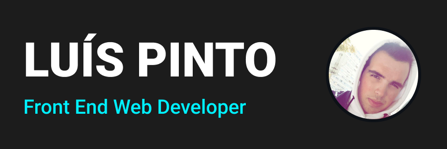

# 

### Hi there 👋 ! I'm Luís Pinto a Front End Developer from Portugal.

----------------------------------------------------------------------
### My Top Languages: 

### Web Frameworks i have experience with: 

### CSS Frameworks i have worked with: 

### Sofware I have worked with: 

